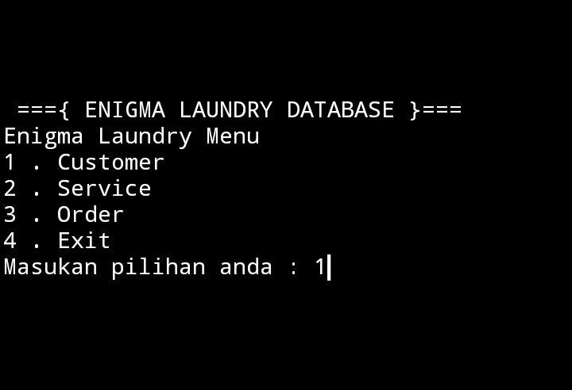
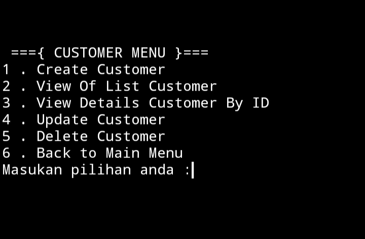
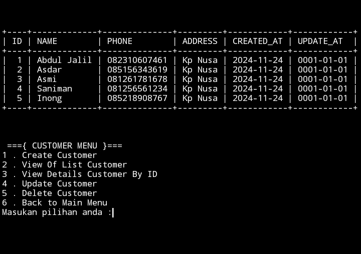
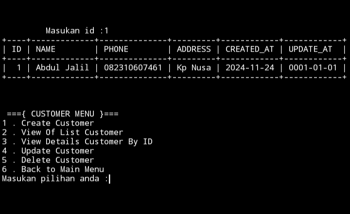
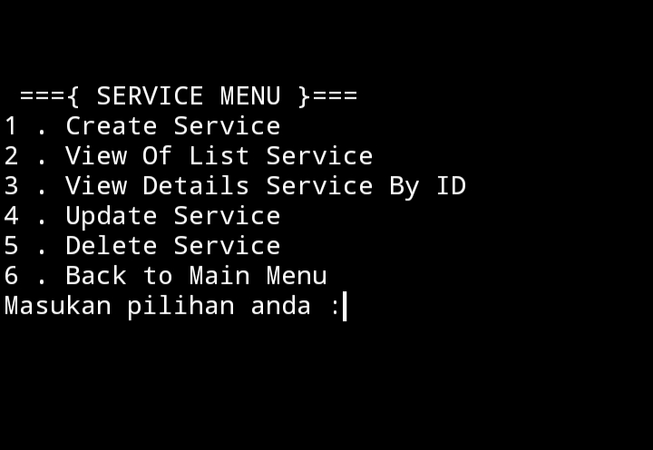
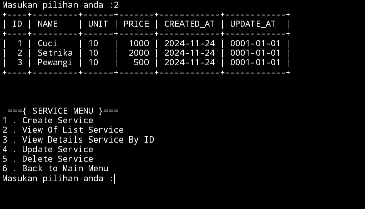
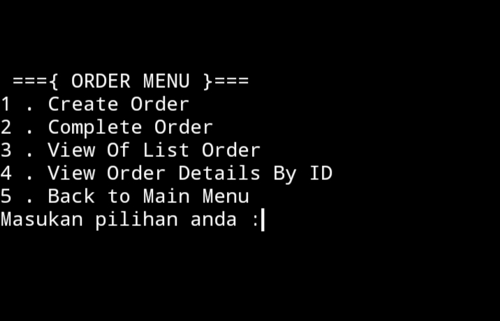
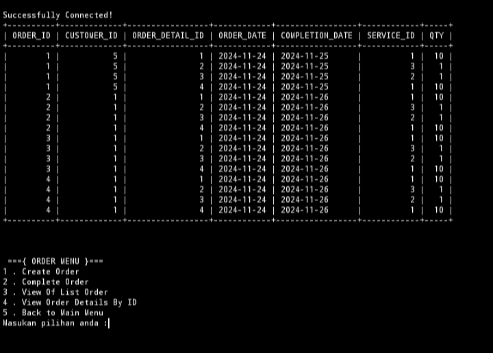
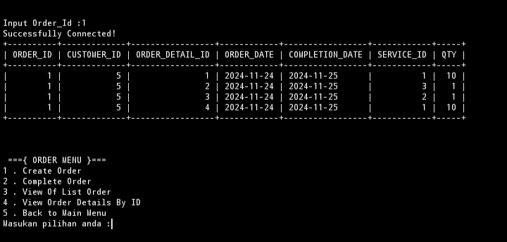

# ENIGMA LAUNDY
> Sebuah aplikasi berbasis CLI sebagai pencatatan orderan pelanggan yang tersimpan kedalam database.

## Penggunaan

> Menu memiliki 3 pilihan
1. Menu untuk menghandle Pelanggan
2. Menu untuk menghandle Layanan
3. Menu untuk transaksi
4. Jika inggin ke menu utama

### Menu Pelanggan

1. Untuk pendaftaran pelanggan
2. Untuk melihat seluruh pelanggan

3. Untuk melihan pelanggan berdasarkan ID

4. Untuk mengupdate data pelanggan 
5. Untuk menghapus pelanggan berdasarkan ID
6. Untuk kembali kr menu utama

### Menu Service

1. Untuk menambahkan layanan baru
2. Untuk melihat seluruh layanan

3. Untuk mencaru layanan berdasarkan ID

4. Untuk mengupdate layanan
5. kembali ke menu utama

###  Menu Order

1. Untuk membuat pesanan baru
2. Untuk menyelesaikan pesanan
3. Untuk melihat isi orderan

4. Untuk mencari orderan dengan id

5. Untuk kembalu ke menu utama 

terimakasih

